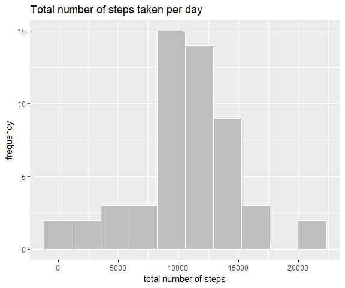
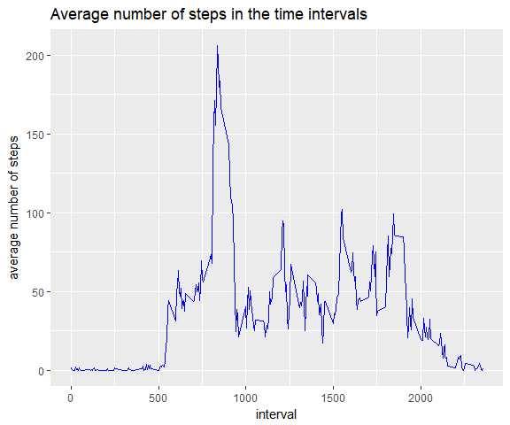
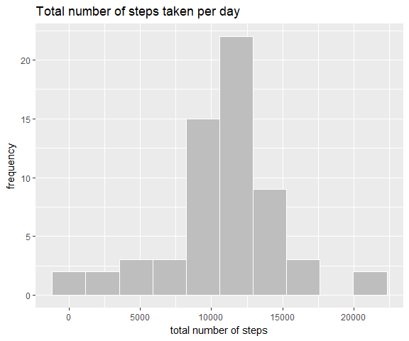
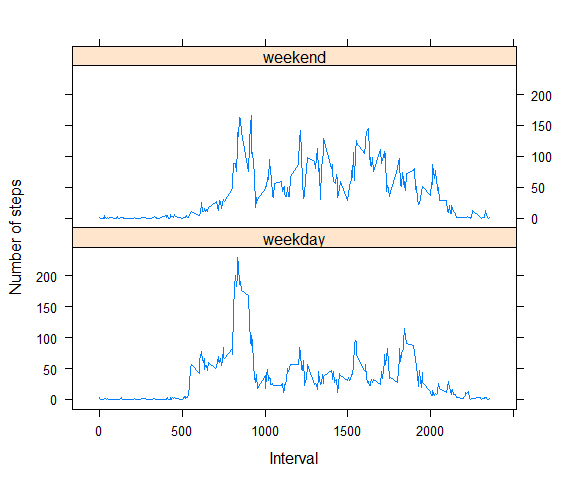

## Loading and preprocessing the data
1. Reading data into R and look at it

```r
if(!file.exists("activity.csv") & file.exists("activity.zip")) {
    unzip("activity.zip")    # dir: "./"
}
activityData <- read.csv("activity.csv", sep = ",", header = TRUE)
str(activityData)
```

```
## 'data.frame':	17568 obs. of  3 variables:
##  $ steps   : int  NA NA NA NA NA NA NA NA NA NA ...
##  $ date    : Factor w/ 61 levels "2012-10-01","2012-10-02",..: 1 1 1 1 1 1 1 1 1 1 ...
##  $ interval: int  0 5 10 15 20 25 30 35 40 45 ...
```

2. Processing the data
- added additional variable to the dataset containing the date as Date object: **dateconv**  
- added additional variable containing the type of the day ('weekday' or 'weekend'): **daytype**  

```r
# conversion of 'date' to Date type
activityData <- mutate(activityData, dateconv = ymd(date))
# creating the date type factor: if the weekday is 1 (Sun) or 7 (Sat) then it is 'weekend'
activityData <- mutate(activityData, 
                       daytype=
                           factor(
                               1*(wday(dateconv)==1 | wday(dateconv) == 7), 
                               # labels: 0 (FALSE) = "weekday", 1 (TRUE) = "weekday"
                               labels=c("weekday","weekend") 
                        )
                       )
```

3. Checking the data

```r
str(activityData)
```

```
## 'data.frame':	17568 obs. of  5 variables:
##  $ steps   : int  NA NA NA NA NA NA NA NA NA NA ...
##  $ date    : Factor w/ 61 levels "2012-10-01","2012-10-02",..: 1 1 1 1 1 1 1 1 1 1 ...
##  $ interval: int  0 5 10 15 20 25 30 35 40 45 ...
##  $ dateconv: Date, format: "2012-10-01" "2012-10-01" ...
##  $ daytype : Factor w/ 2 levels "weekday","weekend": 1 1 1 1 1 1 1 1 1 1 ...
```

```r
head(activityData, 5)
```

```
##   steps       date interval   dateconv daytype
## 1    NA 2012-10-01        0 2012-10-01 weekday
## 2    NA 2012-10-01        5 2012-10-01 weekday
## 3    NA 2012-10-01       10 2012-10-01 weekday
## 4    NA 2012-10-01       15 2012-10-01 weekday
## 5    NA 2012-10-01       20 2012-10-01 weekday
```

```r
tail(activityData, 5)
```

```
##       steps       date interval   dateconv daytype
## 17564    NA 2012-11-30     2335 2012-11-30 weekday
## 17565    NA 2012-11-30     2340 2012-11-30 weekday
## 17566    NA 2012-11-30     2345 2012-11-30 weekday
## 17567    NA 2012-11-30     2350 2012-11-30 weekday
## 17568    NA 2012-11-30     2355 2012-11-30 weekday
```

4. Checking the distribution of the _NA_ values:

This is important becuse of the later use of the _sum_ function. If the option _na.rm_ set to _TRUE_
then the _sum_ handles these values as 0 and returns 0 as result for a vector containing only _NA_ values, 
leading to unexpected results for example in case of calulating the mean of the summarized data 
(note: the _mean_ function returns _NaN_ or _NA_ respectively, if all or some of the values 
are missing).

```r
sumTest <- c(
    sum_na_with_number = sum(c(NA, 3), na.rm = TRUE),
    sum_na_vector = sum(c(NA, NA), na.rm = TRUE)
)
c(sumTest, mean_of_sums = mean(sumTest))
```

```
## sum_na_with_number      sum_na_vector       mean_of_sums 
##                3.0                0.0                1.5
```

This means that the distribution of the missing values (whether they are mixed 
with real values or not in a group) can have an impact on the 
method used for "ignoring" them.

To check the distribution I calculated the ratio of _NA_ values for each analyzed groups.
If this value is equal to 1, than all data is missing in that group and the summarization 
can introduce false 0s.

Checking the dates:

```r
group_by(activityData, date) %>% 
    summarize(na_ratio = sum(1 * is.na(steps))/length(steps)) %>% 
    filter(na_ratio == 1) %>%
    data.frame()
```

```
##         date na_ratio
## 1 2012-10-01        1
## 2 2012-10-08        1
## 3 2012-11-01        1
## 4 2012-11-04        1
## 5 2012-11-09        1
## 6 2012-11-10        1
## 7 2012-11-14        1
## 8 2012-11-30        1
```

Checking the intervals:

```r
group_by(activityData, interval) %>% 
    summarize(na_ratio = sum(1 * is.na(steps))/length(steps)) %>% 
    filter(na_ratio == 1) %>%
    data.frame()
```

```
## [1] interval na_ratio
## <0 rows> (or 0-length row.names)
```

**Based on these results I decided to remove the rows with missing step data for **
**the calculation where _sum_ needs to be used.**

```r
activityData.na <- filter(activityData, !is.na(steps))
```


## What is mean total number of steps taken per day?
For this calculation I group the data by the _date_ variable:

```r
steps.date <- group_by(activityData.na, date) %>%       # groupping the data
    summarize(steps=sum(steps, na.rm = TRUE)) %>%       # summarizing the values
    data.frame()
```

Histogram from the groupped data:  

```r
# create the histogram
ggplot(steps.date, aes(steps)) +
    geom_histogram(
        bins=10, 
        colour="white", 
        fill="gray"
    ) +
    labs(
        title="Total number of steps taken per day",
        x="total number of steps", 
        y = "frequency"
    )
```

<!-- -->
  
**Note**: I set the number of histogram bars to 10 after trying out some lower and higher values. 
Division the data into 10 groups allows the detection of change in the plot when
the _NA_ values are exchanged, but not too detailed to be hard to find the changes.

Calculation of **mean** and **median**:

```r
steps.date.mean <- mean(steps.date$steps, na.rm = TRUE)
steps.date.median <- median(steps.date$steps, na.rm = TRUE)
```
**mean**: 10766.189

**median**: 10765

## What is the average daily activity pattern?
For this calculation I need to group the data by the _interval_ variable:

```r
steps.interval <- group_by(activityData, interval) %>%      # groupping the data
    summarize(meansteps=mean(steps, na.rm = TRUE)) %>%      # calculating the mean
    data.frame()
```
Creating a time searies plot over the intervals:  

```r
ggplot(steps.interval, aes(interval, meansteps)) +
    geom_line(color="blue") +
    labs(
        title="Average number of steps in the time intervals",
        x="interval", 
        y = "average number of steps"
    )
```

<!-- -->

**The interval with the maximum number of steps:**

```r
steps.interval$interval[which.max(steps.interval$meansteps)]
```

```
## [1] 835
```

## Imputing missing values
The number of rows with NA values can be computed with the following formula:
$n_{NA} = n_{all} - n_{good}$

```r
nrow(activityData) - nrow(activityData.na)
```

```
## [1] 2304
```

I will replace the _NA_ values with the mean number of steps caluclated 
over all days in the same interval.

```r
activityData.fill <- activityData # copy data into a new dataset
activityData.fill <-
    # joining the mean values with the data set
    merge(activityData.fill, steps.interval, by.x="interval", by.y = "interval", all = FALSE) %>%
    # replacing the NA values with the mean values
    mutate(steps= ifelse(is.na(steps), meansteps, steps)) %>% 
    # removing the mean value column as it not needed anymore
    select(-meansteps) %>%
    # re-arraging the data set to be able to compare with the original data set
    arrange(dateconv, interval)
```

The new data frame looks like this:

```r
str(activityData.fill)
```

```
## 'data.frame':	17568 obs. of  5 variables:
##  $ interval: int  0 5 10 15 20 25 30 35 40 45 ...
##  $ steps   : num  1.717 0.3396 0.1321 0.1509 0.0755 ...
##  $ date    : Factor w/ 61 levels "2012-10-01","2012-10-02",..: 1 1 1 1 1 1 1 1 1 1 ...
##  $ dateconv: Date, format: "2012-10-01" "2012-10-01" ...
##  $ daytype : Factor w/ 2 levels "weekday","weekend": 1 1 1 1 1 1 1 1 1 1 ...
```

```r
head(activityData.fill, 5)
```

```
##   interval  steps       date   dateconv daytype
## 1        0 1.7170 2012-10-01 2012-10-01 weekday
## 2        5 0.3396 2012-10-01 2012-10-01 weekday
## 3       10 0.1321 2012-10-01 2012-10-01 weekday
## 4       15 0.1509 2012-10-01 2012-10-01 weekday
## 5       20 0.0755 2012-10-01 2012-10-01 weekday
```

```r
tail(activityData.fill, 5)
```

```
##       interval steps       date   dateconv daytype
## 17564     2335 4.698 2012-11-30 2012-11-30 weekday
## 17565     2340 3.302 2012-11-30 2012-11-30 weekday
## 17566     2345 0.642 2012-11-30 2012-11-30 weekday
## 17567     2350 0.226 2012-11-30 2012-11-30 weekday
## 17568     2355 1.075 2012-11-30 2012-11-30 weekday
```

Histogram of the mean total steps of each day:

```r
fill.steps.date <- group_by(activityData.fill, date) %>% 
    summarize(steps=sum(steps)) %>% 
    data.frame()
ggplot(fill.steps.date, aes(steps)) +
    geom_histogram(
        bins=10, 
        colour="white", 
        fill="gray"
    ) +
    labs(
        title="Total number of steps taken per day",
        x="total number of steps", 
        y = "frequency"
    )
```

<!-- -->

Calculation of **mean** and **median**:

```r
fill.steps.date.mean <- mean(fill.steps.date$steps)
fill.steps.date.median <- median(fill.steps.date$steps)
```
**mean**: 10766.189

**median**: 10766.189

### Comparing the data set without _NA_ values and with replaced _NA_ values:

```r
matrix(
    c(steps.date.mean, steps.date.median, fill.steps.date.mean, fill.steps.date.median), 
    nrow = 2, byrow = TRUE,
    dimnames = list(c("without NA", "replaced NA"), c("mean","median"))
)
```

```
##              mean median
## without NA  10766  10765
## replaced NA 10766  10766
```

In this dataset calculating the mean of total steps taken per day and replacing 
the missing values with the mean of the steps of the same interval across all days
**has no effect** on the results.

The reason of this is that the _NA_ values are not mixed with real values during the days
where they appear.

Detailed explanation is at [the end of the document](#APX).


## Are there differences in activity patterns between weekdays and weekends?
For this calculation I group the data by the _interval_ and _datatype_ variables. The latter I created during processing the data.

```r
steps.daytype <- group_by(activityData.fill, daytype, interval) %>%     # groupping
    summarize(meansteps=mean(steps, na.rm = TRUE)) %>%                  # calculating the mean
    data.frame()
```
Creating a time searies plots over the intervals using the _lattice_ plotting system:  

```r
xyplot(meansteps ~ interval | daytype, data = steps.daytype, layout=c(1,2), type='l',
       xlab="Interval", ylab="Number of steps"
       )
```

<!-- -->

## Appendix: why does not effect the replacement of the _NA_ values the mean value? {#APX}

Mean of steps taken in an interval $i$ over the days:

$\overline{x}_{i} = \frac{\displaystyle \sum_{d}^{N} x_{d,i} }{N}$

where $d$ runs only the days with data and $N$ is the number of days with data


The total number of steps on a day $d$ (with data available):

$S_d = \displaystyle \sum_{i}^{N^{i}} x_{d,i}$

where $N^{i}$ is the number of intervals

On the days where no data available and the _NA_ values were replaced with the mean values of the interval,
which causes all days will have the same value:

$S_{d^*} = \displaystyle \sum_{i}^{N^{i}} \overline{x}_{i} = S^*$

Substituing $\overline{x}_{i}$ we get the global mean of total number of steps in a day without the missing values:
$S^{*} = \displaystyle \sum_{i}^{N^{i}} \frac{\displaystyle \sum_{d}^{N} x_{d,i} }{N} = \frac{\displaystyle \sum_{i}^{N^{i}}\sum_{d}^{N} x_{d,i}  }{N} = \frac{\displaystyle \sum_{d}^{N}S_d  }{N}$


Calculating the mean of total number of steps with the replaced _NA_ values:

$\overline{S}= \frac{\left(\displaystyle \sum_{d}^{N}S_{d}\right) + N^{*}S^*}{N + N^{*}} = \frac{\left(\displaystyle \sum_{d}^{N}S_{d}\right) + \displaystyle N^* \frac{\displaystyle \sum_{d}^{N}S_{d}}{N}}{N + N^{*}}= \frac{\displaystyle(N + N^{*})\displaystyle \sum_{d}^{N}S_{d}}{N(N + N^{*})}=\frac{\displaystyle \sum_{d}^{N}S_d  }{N}$

which is the same result as in case of removing the rows with missing observations from the dataset.
